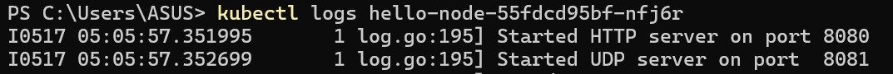
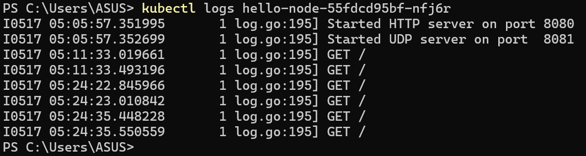
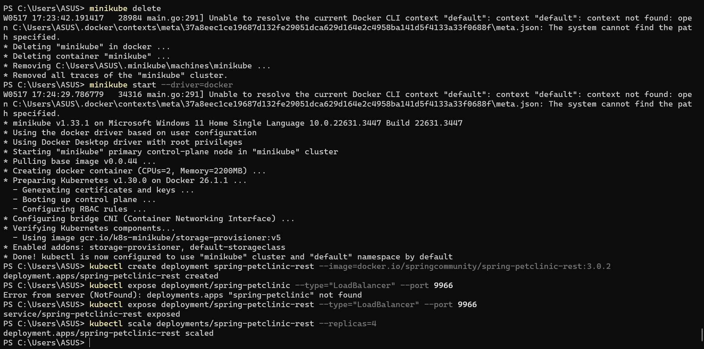
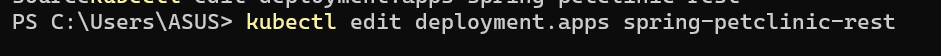
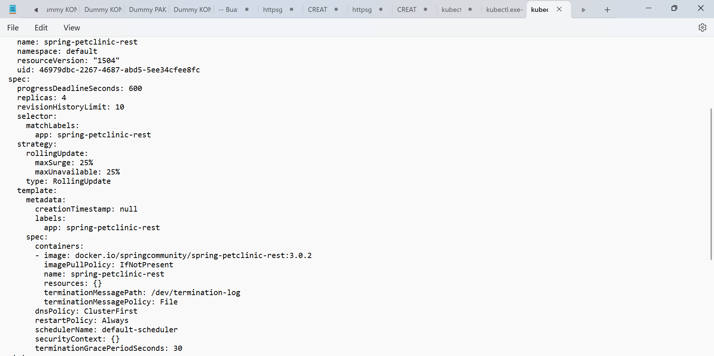
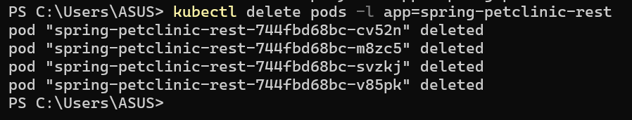
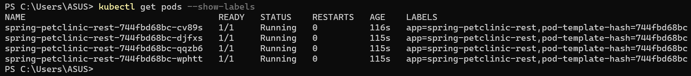
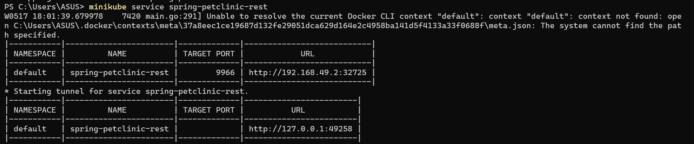

## Refleksi tutorial 11

1. Dari kedua gambar di atas. Ketika kita belum mengekspos service, log tidak akan ditampilkan karena tidak ada browser yang dibuka. Sedangkan, saat kita mengeskpos service, service akan melakukan request GET dan nantinya request tersebut dapat dilihat di dalam log kita.

2. Dengan adanya -n (Namespace) kita bisa mengspesifikasikan pada namespace yang ingin kita lihat perintah GET. Tujuan dari penggunaannya -n adalah untuk mengatasi kondisi dimana kita memiliki banyak service yang berbeda yang memiliki nama yang sama dan tersebar di berbagai namespace yang berbeda.

## Reflection on Rolling Update & Kubernetes Manifest File

1. Recreate deployment memerlukan waktu yang lebih lama karena (downtime) dalam melakukan pembaruan aplikasi karena proses deployment ini perlu menghapus aplikasi nya terlebih dahulu dan kemudian membuat aplikasi yang baru. Di sisi lain, rolling update deployment bekerja dengan cara mengubah aplikasi secara perlahan ke versi terbaru.

2. 

