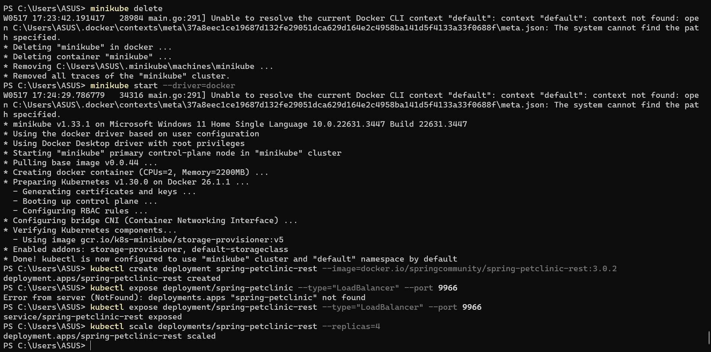
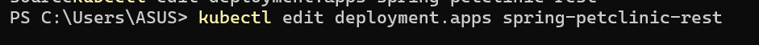
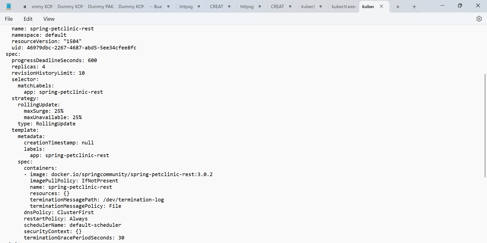
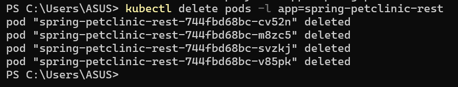
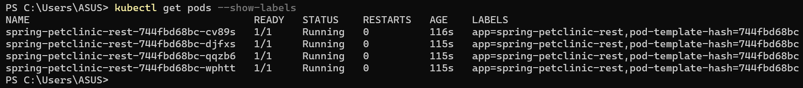
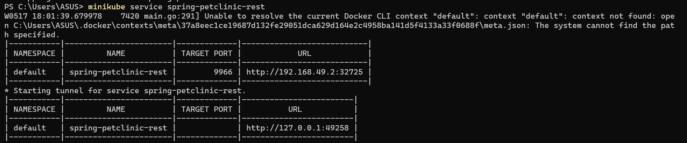
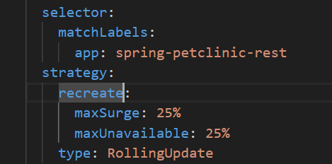
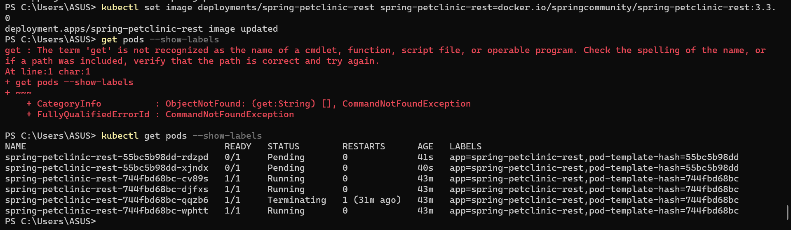

## Refleksi tutorial 11

1. Dari kedua gambar di atas. Ketika kita belum mengekspos service, log tidak akan ditampilkan karena tidak ada browser yang dibuka. Sedangkan, saat kita mengeskpos service, service akan melakukan request GET dan nantinya request tersebut dapat dilihat di dalam log kita.

2. Dengan adanya -n (Namespace) kita bisa mengspesifikasikan pada namespace yang ingin kita lihat perintah GET. Tujuan dari penggunaannya -n adalah untuk mengatasi kondisi dimana kita memiliki banyak service yang berbeda yang memiliki nama yang sama dan tersebar di berbagai namespace yang berbeda.

## Reflection on Rolling Update & Kubernetes Manifest File

1. Recreate deployment memerlukan waktu yang lebih lama karena (downtime) dalam melakukan pembaruan aplikasi karena proses deployment ini perlu menghapus aplikasi nya terlebih dahulu dan kemudian membuat aplikasi yang baru. Di sisi lain, rolling update deployment bekerja dengan cara mengubah aplikasi secara perlahan ke versi terbaru.

2. Pertama, app springboot-petclinic-rest yang sudah discale ke versi 3.0.2 akan direcreate 

    Dengan memanfaatkan sifat dari repilcaset yang akan selalu menggantikan pod yang terhapus, maka akan digantikan versinya menjadi 3.2.1 dengan menjalankan perintah berikut

    Kita dapat mengecek apakah perubahan tersebut berhasil atau tidaknya. Akan muncul window yang akan menampilkan secara detil.

    Lalu kita coba delete pod yang sudah ada sebelumnya

    Pod baru akan dibuat untuk menggantikan pod yang sudah dihapus sebelumnya

    Kita run kembali service nya dan akan muncul seperti di bawah

3. Kita bisa membuat file baru (dalam repository ini adalah deployment2.yaml). Isi dari file ini sama seperti dengan file deployment.yaml yang sudah kita buat sebelumnya. Namun, ada perubahan kecil pada bagian di bawah ini

    File yang sudah kita buat tersebut (deployment2.yaml) dapat diimport oleh kubernetes sebagai file manifest seperti sebelum-sebelumnya. Kita dapat melakukan pengujian dengan mengganti image pada file ini ke versi yang kita inginkan. Hal ini akan menghapus replicasets lama dan akan mendeploy pods pada replicasets baru.

4. Manfaat utama dari penggunaan file manifest adalah efisiensi. Dengan menggunakan manifest file, kita tidak perlu lagi mengingat prosedur dan sintaks yang diperlukan untuk melakukan pembaruan atau deployment awal. Kita hanya perlu tahu bahwa kita sudah memiliki dokumen yang siap pakai. Selain itu, penggunaan file manifest juga mengurangi kemungkinan human error atau kesalahan pada manusia, karena layanan yang dibuat pasti sesuai dengan isi file tersebut, menghindari kesalahan ketik yang mungkin dilakukan oleh para programmer jika mengetik sintaks satu per satu.
